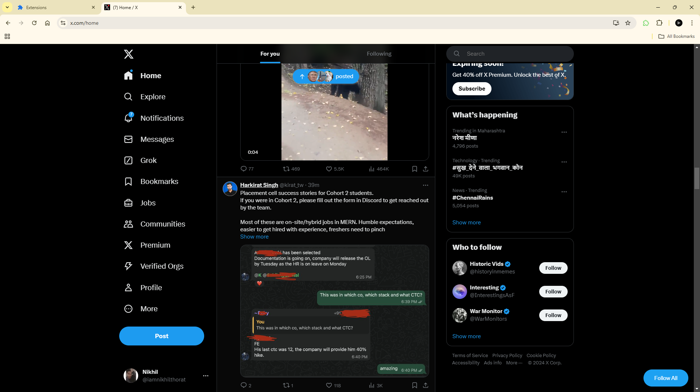

# React Intern Assignment : Chrome Extension for Twitter

An Extension built using wxt.dev & React Framework, to automate following users on Twitter/X For You Tab

## How this Extension works

- Loads automatically when user visits Twitter/X.
- Renders `Follow All` Button at the bottom right of the page.
- Clicking the button will switch to `For You` tab on the home page.
- Then it will start hovering over the visible users in the page and will click the follow button once hover card is displayed.
- It will skip the user if already following or not able to find the user profile link.
- It will automatically scroll down if it does not found any users and will continue the process until there are users to follow.
- It will stop once there are no more users to follow.

## Screen Shot

## Working of the Extension

<video width="320" height="240" controls>

  <source src="./src/public/media/demo-video.mp4" type="video/mp4">
</video>
